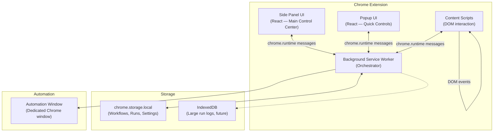

# Loop — Browser Workflow Recorder + Replayer

**Goal:** Build a Chrome Extension (Manifest V3) MVP that lets users record a browser workflow once, then replay it automatically — including cross-tab variable passing, batch execution, and a step editor.

**Theme:** Light background, white base, with light blue/pink gradient accents.

---

## User Review Required

> [!IMPORTANT]
> **Build tooling choice:** Using `@crxjs/vite-plugin` with Vite + React + TypeScript. This gives us HMR in development, automatic entry-point resolution from `manifest.json`, and zero manual Rollup config. The plugin handles bundling the background service worker, content scripts, popup, and side panel automatically.

> [!IMPORTANT]
> **State management:** Zustand for UI state within the side panel/popup, with `chrome.storage.local` as the persistent source of truth for workflows and run history. The background service worker is the single authority for runtime state (recording state, execution state, variables). All other contexts communicate via `chrome.runtime` messaging.

> [!WARNING]
> **Permissions:** The MVP will request `<all_urls>` host permissions for development. This is intentional — it allows content script injection on any page. Before any public release, permissions should be scoped down.

> [!IMPORTANT]
> **CSS approach:** Using vanilla CSS with CSS custom properties for the design system (per your preference — no Tailwind). The light blue/pink gradient theme will be implemented as CSS variables.

---

## Architecture Overview



### Messaging Protocol

All inter-context communication uses a typed message bus:

```
{ type: string, payload: any, source: 'sidepanel' | 'popup' | 'content' | 'background' }
```

The background service worker is the **hub** — content scripts never message each other directly.

---

## Proposed Changes

### Milestone 1: Extension Skeleton + Design System

Set up the project structure, build tooling, manifest, and all entry points. Establish the design system and messaging infrastructure.

---

#### [NEW] [package.json](file:///Users/ukhan2024/Desktop/Loop/package.json)

Dependencies:
- `react`, `react-dom` — UI framework
- `zustand` — lightweight state management
- `@crxjs/vite-plugin` — Vite integration for Chrome extensions
- `typescript`, `vite`, `@vitejs/plugin-react` — build tooling
- `@types/chrome` — Chrome API type definitions

#### [NEW] [tsconfig.json](file:///Users/ukhan2024/Desktop/Loop/tsconfig.json)

TypeScript config targeting ES2022 with DOM lib, strict mode, path aliases (`@/` → `src/`).

#### [NEW] [vite.config.ts](file:///Users/ukhan2024/Desktop/Loop/vite.config.ts)

Vite config with `@crxjs/vite-plugin` and `@vitejs/plugin-react`. The CRXJS plugin reads `manifest.json` and auto-discovers entry points.

#### [NEW] [src/manifest.json](file:///Users/ukhan2024/Desktop/Loop/src/manifest.json)

Manifest V3 with:
- `action` → popup
- `side_panel` → side panel HTML
- `background.service_worker` → background script
- `permissions`: `sidePanel`, `tabs`, `activeTab`, `scripting`, `storage`
- `host_permissions`: `<all_urls>`
- No statically declared content scripts (injected dynamically via `chrome.scripting`)

---

#### [NEW] [src/shared/types.ts](file:///Users/ukhan2024/Desktop/Loop/src/shared/types.ts)

Core TypeScript types for the entire application:

```ts
// === Target Element Model ===
type TargetDescriptor = {
  kind: 'button' | 'input' | 'link' | 'table_cell' | 'select' | 'generic';
  selectorCandidates: string[];
  xpathCandidates: string[];
  label?: string;
  text?: string;
  placeholder?: string;
  ariaLabel?: string;
  containerText?: string;
  tagName: string;
  attributes: Record<string, string>;
};

// === Workflow Step Types ===
type StepType =
  | 'open_url' | 'focus_tab' | 'wait_for_url' | 'wait_for_element'
  | 'click' | 'fill_input' | 'select_option' | 'extract_text'
  | 'extract_value' | 'save_variable' | 'submit_form' | 'delay'
  | 'assert_text_present';

type WorkflowStep = {
  id: string;
  type: StepType;
  target?: TargetDescriptor;
  tabRef?: string;
  url?: string;
  value?: string;
  valueTemplate?: string;
  saveAs?: string;
  timeout?: number;
  description?: string;
};

// === Workflow ===
type Workflow = {
  id: string;
  name: string;
  version: number;
  createdAt: string;
  updatedAt: string;
  steps: WorkflowStep[];
  tabRefs: Record<string, { url: string; title: string }>;
};

// === Run ===
type RunStatus = 'idle' | 'running' | 'paused' | 'failed' | 'completed';

type Run = {
  id: string;
  workflowId: string;
  status: RunStatus;
  startedAt: string;
  finishedAt?: string;
  currentStepIndex: number;
  variables: Record<string, string>;
  logs: RunLog[];
  batchIndex?: number;
  batchTotal?: number;
};

type RunLog = {
  stepId: string;
  timestamp: string;
  level: 'info' | 'warn' | 'error' | 'success';
  message: string;
  data?: any;
};

// === Messages ===
type MessageType =
  | 'START_RECORDING' | 'STOP_RECORDING' | 'RECORDING_EVENT'
  | 'RUN_WORKFLOW' | 'PAUSE_RUN' | 'RESUME_RUN' | 'STOP_RUN'
  | 'EXECUTE_STEP' | 'STEP_RESULT'
  | 'STATE_UPDATE' | 'GET_STATE'
  | 'MARK_VARIABLE' | 'INJECT_CONTENT_SCRIPT';

type Message = {
  type: MessageType;
  payload?: any;
  source: 'sidepanel' | 'popup' | 'content' | 'background';
};
```

#### [NEW] [src/shared/constants.ts](file:///Users/ukhan2024/Desktop/Loop/src/shared/constants.ts)

Shared constants: storage keys, default timeouts, retry counts, version.

#### [NEW] [src/shared/storage.ts](file:///Users/ukhan2024/Desktop/Loop/src/shared/storage.ts)

Typed wrapper around `chrome.storage.local` for workflows, runs, and settings. Functions:
- `getWorkflows()` / `saveWorkflow()` / `deleteWorkflow()`
- `getRuns()` / `saveRun()`
- `getSettings()` / `saveSettings()`

#### [NEW] [src/shared/utils.ts](file:///Users/ukhan2024/Desktop/Loop/src/shared/utils.ts)

Utility functions: `generateId()`, `resolveTemplate()` (replaces `{{var}}` syntax), `debounce()`, `formatTimestamp()`.

#### [NEW] [src/shared/messageBus.ts](file:///Users/ukhan2024/Desktop/Loop/src/shared/messageBus.ts)

Typed messaging helpers:
- `sendMessage(msg: Message): Promise<any>` — wraps `chrome.runtime.sendMessage`
- `sendTabMessage(tabId, msg)` — wraps `chrome.tabs.sendMessage`
- `onMessage(handler)` — typed listener registration

---

#### [NEW] [src/styles/design-system.css](file:///Users/ukhan2024/Desktop/Loop/src/styles/design-system.css)

CSS custom properties defining the light theme with blue/pink gradient accents:

```css
:root {
  /* Base */
  --color-bg: #FFFFFF;
  --color-bg-secondary: #F8F9FC;
  --color-bg-tertiary: #F0F2F8;
  --color-surface: #FFFFFF;
  --color-border: #E2E6F0;
  --color-border-light: #EEF0F6;

  /* Text */
  --color-text-primary: #1A1D2E;
  --color-text-secondary: #6B7194;
  --color-text-tertiary: #9DA3C0;

  /* Accent gradient — light blue to pink */
  --gradient-accent: linear-gradient(135deg, #7EB6FF 0%, #D4A5FF 50%, #FFB3D9 100%);
  --gradient-accent-subtle: linear-gradient(135deg, #E8F1FF 0%, #F3E8FF 50%, #FFE8F3 100%);
  --color-accent-blue: #5B9BF7;
  --color-accent-pink: #E890C0;
  --color-accent-purple: #B088F0;

  /* Status */
  --color-success: #34D399;
  --color-warning: #FBBF24;
  --color-error: #F87171;
  --color-info: #60A5FA;

  /* Spacing, radius, shadows */
  --radius-sm: 6px;
  --radius-md: 10px;
  --radius-lg: 16px;
  --shadow-sm: 0 1px 3px rgba(0,0,0,0.04);
  --shadow-md: 0 4px 12px rgba(0,0,0,0.06);
  --shadow-lg: 0 8px 32px rgba(0,0,0,0.08);

  /* Typography */
  --font-family: 'Inter', -apple-system, sans-serif;
  --font-size-xs: 11px;
  --font-size-sm: 13px;
  --font-size-md: 14px;
  --font-size-lg: 16px;
  --font-size-xl: 20px;
  --font-size-2xl: 24px;
}
```

#### [NEW] [src/styles/global.css](file:///Users/ukhan2024/Desktop/Loop/src/styles/global.css)

Global resets, base typography, utility classes, scrollbar styling, animation keyframes.

---

#### [NEW] [src/background/index.ts](file:///Users/ukhan2024/Desktop/Loop/src/background/index.ts)

Service worker entry point:
- Opens side panel on action click (`chrome.sidePanel.setPanelBehavior`)
- Registers message listener hub (routes messages to appropriate handlers)
- Initializes storage on install

#### [NEW] [src/background/tabManager.ts](file:///Users/ukhan2024/Desktop/Loop/src/background/tabManager.ts)

Tab tracking utility:
- Track active tabs, URLs, and tab references for workflows
- Map `tabRef` IDs to actual tab IDs during replay
- `ensureContentScript(tabId)` — dynamically inject content script if not present

---

#### [NEW] [src/popup/popup.html](file:///Users/ukhan2024/Desktop/Loop/src/popup/popup.html) + [main.tsx](file:///Users/ukhan2024/Desktop/Loop/src/popup/main.tsx) + [Popup.tsx](file:///Users/ukhan2024/Desktop/Loop/src/popup/Popup.tsx)

Minimal popup with:
- "Open Side Panel" button
- Current status indicator (idle / recording / running)
- Quick "Start Recording" button

#### [NEW] [src/sidepanel/sidepanel.html](file:///Users/ukhan2024/Desktop/Loop/src/sidepanel/sidepanel.html) + [main.tsx](file:///Users/ukhan2024/Desktop/Loop/src/sidepanel/main.tsx) + [App.tsx](file:///Users/ukhan2024/Desktop/Loop/src/sidepanel/App.tsx)

Side panel React app — scaffolded with routing between views:
- Home / Workflow List
- Recording View
- Workflow Detail / Editor
- Run View / Logs

#### [NEW] [src/content/index.ts](file:///Users/ukhan2024/Desktop/Loop/src/content/index.ts)

Content script entry point — listens for messages from background, dispatches to recorder or executor modules. Announces presence to background on injection.

---

**Milestone 1 Definition of Done:**
- Extension loads in Chrome Developer Mode
- Side panel opens when clicking the extension icon
- Popup displays and "Open Side Panel" works
- Content script can be injected into any tab and round-trip message to background
- Design system renders correctly in side panel

---

### Milestone 2: Recording Engine

Build the DOM event capture system that records user actions as semantic workflow steps.

---

#### [NEW] [src/content/recorder.ts](file:///Users/ukhan2024/Desktop/Loop/src/content/recorder.ts)

The recording engine, injected into pages via content script. Captures:

| Event | DOM Listener | Recorded Step Type |
|-------|-------------|-------------------|
| Click | `click` on `document` (capture phase) | `click` |
| Typing | `input` event on input/textarea/contenteditable | `fill_input` |
| Select change | `change` on `<select>` | `select_option` |
| Form submit | `submit` on `<form>` | `submit_form` |
| Navigation | `beforeunload` / detected by background | `open_url` |

For each captured event, builds a `TargetDescriptor` by:
1. Collecting CSS selectors (ID, class-based, attribute-based, nth-child)
2. Generating XPath
3. Extracting `textContent`, `aria-label`, `placeholder`, `name`, `type`
4. Identifying parent/container context text

Sends `RECORDING_EVENT` messages to background with full step data.

#### [NEW] [src/content/domUtils.ts](file:///Users/ukhan2024/Desktop/Loop/src/content/domUtils.ts)

DOM utility functions:
- `buildTargetDescriptor(element: Element): TargetDescriptor` — multi-strategy selector generation
- `getCssSelector(el: Element): string[]` — generates multiple selector candidates ranked by specificity
- `getXPath(el: Element): string` — generates robust XPath
- `getElementContext(el: Element)` — extracts surrounding text, labels, ARIA info
- `getVisibleText(el: Element): string`
- `isInteractable(el: Element): boolean`

#### [MODIFY] [src/background/index.ts](file:///Users/ukhan2024/Desktop/Loop/src/background/index.ts)

Add recording state management:
- `startRecording()` — set recording flag, inject content scripts into active tab, track tab switches
- `stopRecording()` — compile recorded events into `Workflow`, save to storage
- Handle `RECORDING_EVENT` messages — append to in-progress step list
- Track tab switches via `chrome.tabs.onActivated` → emit `focus_tab` steps
- Track navigations via `chrome.webNavigation.onCompleted` → emit `open_url` steps

#### [NEW] [src/background/workflowBuilder.ts](file:///Users/ukhan2024/Desktop/Loop/src/background/workflowBuilder.ts)

Post-processing of raw recorded events into clean workflow steps:
- Merge rapid sequential `fill_input` on same element into single step
- Convert clipboard copy→paste sequences into `extract_text` + `fill_input` with variables
- Deduplicate redundant `focus_tab` steps
- Assign auto-generated `tabRef` names
- Generate human-readable `description` for each step

#### [NEW] [src/sidepanel/components/RecordingControls.tsx](file:///Users/ukhan2024/Desktop/Loop/src/sidepanel/components/RecordingControls.tsx)

Recording UI:
- Large "Start Recording" button with pulse animation
- "Stop Recording" button (red, with timer showing duration)
- Live event feed showing steps as they're captured
- "Mark as Variable" floating action (sends message to active tab's content script to enter selection mode)

#### [NEW] [src/sidepanel/components/RecordingEventFeed.tsx](file:///Users/ukhan2024/Desktop/Loop/src/sidepanel/components/RecordingEventFeed.tsx)

Real-time feed of recorded events with icons per step type, auto-scrolling.

#### [NEW] [src/sidepanel/store.ts](file:///Users/ukhan2024/Desktop/Loop/src/sidepanel/store.ts)

Zustand store for side panel state:
- `recordingState`: idle | recording | processing
- `currentWorkflow`: Workflow | null
- `workflows`: Workflow[]
- `currentRun`: Run | null
- `runs`: Run[]
- Syncs with background via messaging on state changes

---

**Milestone 2 Definition of Done:**
- User clicks "Start Recording" → content script starts capturing
- Clicks, typing, tab switches, and navigations are captured
- "Stop Recording" produces a structured `Workflow` with semantic steps
- Workflow is saved to `chrome.storage.local`
- Steps are viewable in the side panel

---

### Milestone 3: Execution Engine MVP

Build the replay engine that executes workflow steps on live pages.

---

#### [NEW] [src/background/workflowEngine.ts](file:///Users/ukhan2024/Desktop/Loop/src/background/workflowEngine.ts)

Central execution orchestrator:
- Takes a `Workflow` and produces a `Run`
- Iterates steps sequentially
- For each step:
  1. Resolves target tab (via `tabManager`)
  2. Sends `EXECUTE_STEP` to content script in that tab
  3. Waits for `STEP_RESULT` response
  4. Logs result
  5. Handles retry logic (2 retries with fallback selectors)
- Supports pause/resume/stop signals
- Emits `STATE_UPDATE` messages to side panel

#### [NEW] [src/content/executor.ts](file:///Users/ukhan2024/Desktop/Loop/src/content/executor.ts)

Content-script-side step executor:
- Receives `EXECUTE_STEP` messages
- Locates target element using `targetResolver`
- Performs action (click, fill, extract, etc.)
- Returns `STEP_RESULT` with success/failure and extracted data

Action implementations:
- `click`: `element.click()` with optional `dispatchEvent` for React-controlled elements
- `fill_input`: Set `value`, dispatch `input`/`change`/`keydown` events for framework compatibility
- `select_option`: Set `value` on `<select>`, dispatch `change`
- `extract_text`: Read `textContent` or `value`
- `submit_form`: Find parent `<form>` and call `submit()` or click submit button
- `wait_for_element`: Poll with `MutationObserver` until element appears

#### [NEW] [src/content/targetResolver.ts](file:///Users/ukhan2024/Desktop/Loop/src/content/targetResolver.ts)

Element resolution with fallback chain:

```
1. Try each selectorCandidate → querySelector
2. Try each xpathCandidate → evaluate XPath
3. Try label-based lookup (aria-label, associated <label>, placeholder match)
4. Try text-content match (for buttons/links)
5. Return null if all fail
```

For each match, verify visibility (`offsetParent`, `getBoundingClientRect`).

#### [NEW] [src/content/extraction.ts](file:///Users/ukhan2024/Desktop/Loop/src/content/extraction.ts)

Data extraction utilities:
- `extractText(el)` — get visible text content
- `extractValue(el)` — get form value
- `extractTableRow(el)` — extract key-value pairs from a table row

#### [NEW] [src/sidepanel/views/RunView.tsx](file:///Users/ukhan2024/Desktop/Loop/src/sidepanel/views/RunView.tsx)

Execution UI:
- Current step indicator with progress bar
- Step list with status icons (pending / running / success / error)
- Pause / Resume / Stop buttons
- Real-time log output

#### [NEW] [src/sidepanel/components/StepList.tsx](file:///Users/ukhan2024/Desktop/Loop/src/sidepanel/components/StepList.tsx)

Reusable step list component showing workflow steps with:
- Step type icon
- Description text
- Status indicator (for run view)
- Variable badge (if step uses/produces variables)

---

**Milestone 3 Definition of Done:**
- User can select a saved workflow and click "Run"
- Single-page workflow replays: clicks, fills inputs, submits forms
- Step-by-step progress shown in side panel
- Errors display with retry feedback

---

### Milestone 4: Cross-Tab Variable Passing

Enable extracting data from one tab and using it in another.

---

#### [MODIFY] [src/background/workflowEngine.ts](file:///Users/ukhan2024/Desktop/Loop/src/background/workflowEngine.ts)

Add variable system:
- Maintain `variables: Record<string, string>` in `Run` state
- On `extract_text` / `extract_value` steps: store result in `variables[step.saveAs]`
- On `fill_input` steps: resolve `step.valueTemplate` (e.g. `{{email}}`) against variables before sending to content script
- Pass resolved values in `EXECUTE_STEP` payload

#### [MODIFY] [src/background/tabManager.ts](file:///Users/ukhan2024/Desktop/Loop/src/background/tabManager.ts)

Enhanced tab resolution:
- `focusTab(tabRef)` — bring tab to front, inject content script if needed
- `openUrl(url)` — open in existing or new tab, wait for load
- Handle tab close/crash during execution gracefully

#### [NEW] [src/sidepanel/components/VariablesInspector.tsx](file:///Users/ukhan2024/Desktop/Loop/src/sidepanel/components/VariablesInspector.tsx)

Shows current variable values during a run:
- Variable name → current value table
- Highlight when a variable is set or used
- Empty state when no variables defined

#### [NEW] [src/content/variableMarker.ts](file:///Users/ukhan2024/Desktop/Loop/src/content/variableMarker.ts)

"Mark as Variable" mode:
- Content script enters selection mode on user request
- User clicks element or selects text
- Overlay appears with "Save as variable" prompt and name input
- Creates `extract_text` + `save_variable` step and sends to background

---

**Milestone 4 Definition of Done:**
- Extract email from "spreadsheet" tab, fill it into "form" tab via variable
- Variables visible in side panel inspector during replay
- "Mark as Variable" workflow works during recording

---

### Milestone 5: Automation Window

Run workflows in a dedicated window separate from the user's browsing.

---

#### [MODIFY] [src/background/workflowEngine.ts](file:///Users/ukhan2024/Desktop/Loop/src/background/workflowEngine.ts)

Before execution:
- `chrome.windows.create({ type: 'normal', focused: true })` → automation window
- Open workflow tabs inside this window
- Track `windowId` to constrain execution to automation window
- Option to auto-close window on completion

#### [MODIFY] [src/background/tabManager.ts](file:///Users/ukhan2024/Desktop/Loop/src/background/tabManager.ts)

Scope tab operations to automation window:
- `createTab` within windowId
- `focusTab` within windowId
- Prevent actions escaping to user's main window

#### [NEW] [src/sidepanel/components/AutomationStatus.tsx](file:///Users/ukhan2024/Desktop/Loop/src/sidepanel/components/AutomationStatus.tsx)

Visual indicator showing:
- Automation window is active
- Which tabs are open in it
- Option to bring automation window to focus
- Option to close automation window

---

**Milestone 5 Definition of Done:**
- "Run" opens a new Chrome window
- All replay actions happen in that window
- User's current browsing window is unaffected
- Side panel shows automation window status

---

### Milestone 6: Step Editor

Allow users to review and edit recorded workflows.

---

#### [NEW] [src/sidepanel/views/WorkflowEditor.tsx](file:///Users/ukhan2024/Desktop/Loop/src/sidepanel/views/WorkflowEditor.tsx)

Full workflow editor view:
- Rename workflow (inline editable title)
- Drag-to-reorder steps (or move up/down buttons)
- Delete steps
- Add delay steps manually
- Save changes

#### [NEW] [src/sidepanel/components/StepEditor.tsx](file:///Users/ukhan2024/Desktop/Loop/src/sidepanel/components/StepEditor.tsx)

Individual step editing panel (opens on step click):
- Edit step description
- Edit target selectors (text input for selector candidates)
- Edit variable name (`saveAs` field)
- Edit value template
- Edit timeout/delay
- "Test this step" button (executes single step)

#### [NEW] [src/sidepanel/views/WorkflowList.tsx](file:///Users/ukhan2024/Desktop/Loop/src/sidepanel/views/WorkflowList.tsx)

Saved workflows dashboard:
- Cards showing workflow name, step count, last run date
- Run / Edit / Delete actions
- Search/filter bar
- Empty state with onboarding prompt

---

**Milestone 6 Definition of Done:**
- User can rename workflows
- User can delete/reorder steps
- User can edit selectors and variable names
- "Test step" executes a single step successfully
- Changes persist to storage

---

### Milestone 7: Batch Mode + Run History

Loop execution over multiple items and complete logging.

---

#### [NEW] [src/background/batchEngine.ts](file:///Users/ukhan2024/Desktop/Loop/src/background/batchEngine.ts)

Batch execution controller:
- User defines row selector pattern (e.g. `table tbody tr`)
- For each row:
  1. Set row as active context
  2. Extract variables from row
  3. Execute fill/submit steps on destination tab
  4. Return to source tab
  5. Advance to next row
- Track batch progress (`batchIndex` / `batchTotal`)
- Stop-on-error or continue options

#### [NEW] [src/sidepanel/views/BatchConfig.tsx](file:///Users/ukhan2024/Desktop/Loop/src/sidepanel/views/BatchConfig.tsx)

Batch configuration UI:
- Row selector input
- Preview of detected rows (count)
- Start row / end row range
- "Confirm before each submit" toggle
- Start batch button

#### [NEW] [src/sidepanel/views/RunHistory.tsx](file:///Users/ukhan2024/Desktop/Loop/src/sidepanel/views/RunHistory.tsx)

Run history dashboard:
- Past runs listed with: workflow name, date, status, row count
- Click to expand → full step-by-step log
- Variable snapshot per run
- Filter by workflow / status

#### [NEW] [src/sidepanel/components/RunLogViewer.tsx](file:///Users/ukhan2024/Desktop/Loop/src/sidepanel/components/RunLogViewer.tsx)

Detailed log viewer:
- Timestamped log entries
- Color-coded by level (info/warn/error/success)
- Expandable data details
- Copy log to clipboard

---

**Milestone 7 Definition of Done:**
- Batch mode processes multiple rows from a table
- Each row's extraction + form fill + submit completes
- Full run history with logs is browsable
- Variable snapshots viewable per run

---

### Test Environment

#### [NEW] [test-pages/spreadsheet.html](file:///Users/ukhan2024/Desktop/Loop/test-pages/spreadsheet.html)

Fake spreadsheet page with:
- HTML table with 10 rows × 3 columns (Name, Email, Company)
- Clickable rows that highlight on selection
- Styled to look like a simple data table

#### [NEW] [test-pages/form.html](file:///Users/ukhan2024/Desktop/Loop/test-pages/form.html)

Fake form page with:
- Text inputs: Name, Email, Company
- Submit button
- Success confirmation message on submit
- Form validation

#### [NEW] [test-pages/server.js](file:///Users/ukhan2024/Desktop/Loop/test-pages/server.js)

Simple static file server (or use Vite's dev server) to serve test pages locally.

---

## Complete File Tree

```
/Loop
├── package.json
├── tsconfig.json
├── vite.config.ts
├── README.md
├── src/
│   ├── manifest.json
│   ├── styles/
│   │   ├── design-system.css
│   │   └── global.css
│   ├── shared/
│   │   ├── types.ts
│   │   ├── constants.ts
│   │   ├── storage.ts
│   │   ├── utils.ts
│   │   └── messageBus.ts
│   ├── background/
│   │   ├── index.ts
│   │   ├── tabManager.ts
│   │   ├── workflowEngine.ts
│   │   ├── workflowBuilder.ts
│   │   └── batchEngine.ts
│   ├── content/
│   │   ├── index.ts
│   │   ├── recorder.ts
│   │   ├── executor.ts
│   │   ├── domUtils.ts
│   │   ├── extraction.ts
│   │   ├── targetResolver.ts
│   │   └── variableMarker.ts
│   ├── sidepanel/
│   │   ├── sidepanel.html
│   │   ├── main.tsx
│   │   ├── App.tsx
│   │   ├── store.ts
│   │   ├── views/
│   │   │   ├── WorkflowList.tsx
│   │   │   ├── WorkflowEditor.tsx
│   │   │   ├── RunView.tsx
│   │   │   ├── RunHistory.tsx
│   │   │   └── BatchConfig.tsx
│   │   └── components/
│   │       ├── RecordingControls.tsx
│   │       ├── RecordingEventFeed.tsx
│   │       ├── StepList.tsx
│   │       ├── StepEditor.tsx
│   │       ├── VariablesInspector.tsx
│   │       ├── AutomationStatus.tsx
│   │       ├── RunLogViewer.tsx
│   │       └── Header.tsx
│   └── popup/
│       ├── popup.html
│       ├── main.tsx
│       └── Popup.tsx
└── test-pages/
    ├── spreadsheet.html
    ├── form.html
    └── server.js
```

---

## Open Questions

> [!IMPORTANT]
> **1. Element highlight during replay:** Should we inject a visible overlay/border on the target element before each action during replay? This is in your "polish" list — I'd prefer to include it from Milestone 3 onward since it's very useful for debugging. **Confirm?**

> [!IMPORTANT]
> **2. Font loading:** You mentioned Inter font. For a Chrome extension, should I bundle it locally (larger extension size, ~100KB) or load from Google Fonts (requires network, CSP config)? **I recommend bundling locally** for reliability.

> [!NOTE]
> **3. Milestone ordering:** Your spec's milestones and my plan align closely. I'll execute them in order (1→7). Each milestone produces a working, testable increment. If you want to skip or reprioritize anything, let me know.

---

## Verification Plan

### Automated Tests

Each milestone will be verified with manual testing in Chrome Developer Mode:

1. **M1:** Load extension → side panel opens → content script messages round-trip
2. **M2:** Record workflow on test pages → verify saved JSON structure
3. **M3:** Replay single-page workflow on test form → fields fill, button clicks
4. **M4:** Cross-tab: extract from spreadsheet page → fill into form page
5. **M5:** Automation window opens → workflow runs there, not in main window
6. **M6:** Edit workflow → re-run with edits → verify changes take effect
7. **M7:** Batch 5 rows → all 5 submit successfully → logs show each result

### End-to-End Proof

The core proof test:
1. Open `test-pages/spreadsheet.html` and `test-pages/form.html` in separate tabs
2. Record: click row → extract name/email/company → switch tab → fill form → submit
3. Save workflow
4. Replay workflow → automation window opens, runs successfully
5. Run in batch mode for 3 rows → all succeed

### Test Pages

Build and serve the two test pages locally for all verification — no dependency on external websites.
